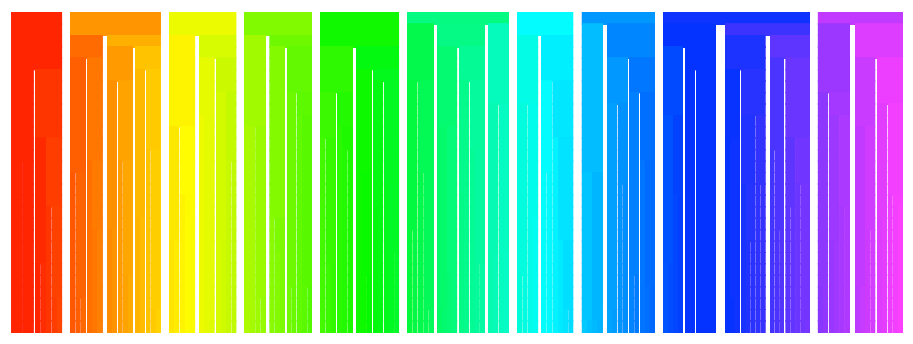

---
output:
  pdf_document: default
  html_document: 
    highlight: tango
---
# Cluster Lookup Tables - cluster LUTs

Coloring for a cluster tree with 145 leaves and 28 levels (10 (top), 15, ..., 145 clusters (bottom)):

## Concepts

A *hue range* specifies a range or set of ranges in hue space ([0..1]). In sets the hue ranges need not be disjunct but usually are in the context of this package.

A *tree range* is a hierarchical collection of hue ranges where each level corresponds to one level of clustering. 

A *color matrix* is a 3x*n* matrix specifying RGB colors (like the output of `col2rgb`)

### Generation
- `hue.range.split`
- `tree.ranges`

### Output
- `hue.range.lines`
- `tree.range.plot`

more details later

Benno Pütz 